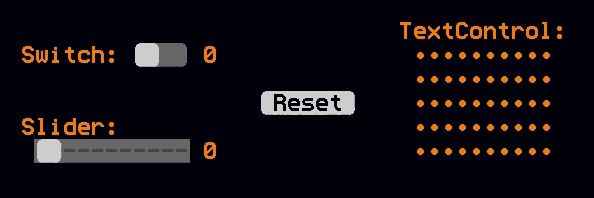

# textUI

The code in `textUI.ms` adds support for event-driven UI widgets using [Mini Micro](https://miniscript.org/MiniMicro])'s [TextDisplay](https://miniscript.org/wiki/TextDisplay), rather than the more typical graphical displays.

This might be useful if you already have a predominately text-based UI, and you just need a button, slider, or switch to go with it.  These controls will beautifully match the existing screen, while still allowing the modern user to interact with your UI using a mouse.

## Usage

1. Copy textUI.ms into your project.
2. `import "textUI"` in your code.
3. Create some controls (see the `demo` function for examples).
4. Be sure to call `textUI.updateHook` to install this module's hook into the event loop, and then call `textUI.runEventLoop` to start the event loop.

